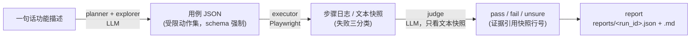

# ai-test-agent

用 LLM Agent 对真实开源系统 **Halo**（halo-dev/halo，开源建站系统）做端到端测试的闭环工具：
一句话功能描述进去，浏览器里真跑一遍、LLM 裁判给结论、报告带成本审计出来。


上面这段 GIF 是两次真实运行的原始录像（[`scripts/record_demo.py`](scripts/record_demo.py)
生成）：健康系统 pass 见
[`reports/20260926T060235Z-site-title-update-and-frontend-display.json`](reports/20260926T060235Z-site-title-update-and-frontend-display.json)，
故障注入后 fail 见
[`reports/20260926T060324Z-site-title-update-and-frontend-display.json`](reports/20260926T060324Z-site-title-update-and-frontend-display.json)。

> **先做再写**：本页每一个数字都来自 [`reports/`](reports/)（Milestone A）或
> [`bench/results/`](bench/results/)（Milestone B/B2），可按 [快速开始](#快速开始) 在干净环境
> 重新跑出。没跑出来的不写；失败运行也保留报告。当前实测版本：Halo **2.20.21**
> （镜像 `registry.fit2cloud.com/halo/halo:2.20`），任务 C 阶段另在最新稳定版 **2.26.1** 上
> 复核过两个发现（见下文与 [`docs/results.md`](docs/results.md)）。

## 不做什么

- 不做通用测试框架、不做多应用适配、不做 UI 界面；
- 不用截图做 OCR 或多模态裁判（成本与可复现性差）——裁判只看文本快照。

## 架构



模块职责、关键决策与取舍、失败与教训、局限与下一步 → [`docs/design.md`](docs/design.md)。

## 关键结果

| 阶段 | 结果 | 出处 |
|---|---|---|
| **A**（闭环跑通） | 4 条用例（3 手写 + 1 planner 生成）步骤级全部通过，裁判全部 pass | [`reports/`](reports/) 对应 run_id 的 JSON；详情见 [`docs/results.md#milestone-a`](docs/results.md#milestone-a-结果数字出处reports-下对应-run_id-的-json) |
| **B**（20 功能 × 5 轮基准） | 覆盖率 53%；LLM 裁判误报 47.2% / 漏报 **0%**；纯断言漏报 30% | [`bench/results/20260925-full/summary.md`](bench/results/20260925-full/summary.md) |
| **B2**（grounded planner：先探索真实页面再写用例） | 覆盖率 53%→**90%**；LLM 裁判误报 47.2%→**17.8%**；漏报仍 0% | [`bench/results/20260926-grounded/comparison.md`](bench/results/20260926-grounded/comparison.md) |

- LLM 裁判相对纯断言的价值在**漏报**（B：注入的故障，纯断言漏 30%，LLM 裁判漏 0%）；
- grounded planner 相对 baseline 的价值在**覆盖率**与**误报率**（同一基准、同一模型对比，公平性红线：
  功能清单/指标口径/执行器/裁判均未改动）；
- 完整过程记录（三次 planner 迭代、逐功能对比、计时 bug、误差分类等，数字与结论未改动）见
  [`docs/results.md`](docs/results.md)。

## 顺带发现的两个 Halo 问题

- **控制台列表/统计页接口报错与空数据无法区分**（评论列表、附件列表、仪表盘统计）：已在 2.20.21
  与最新稳定版 2.26.1 上手工复现，草稿见 [`docs/issues/halo-empty-state-on-api-error.md`](docs/issues/halo-empty-state-on-api-error.md)（未提交 GitHub）。
- ~~文章搜索过滤未生效~~：复核后确认**不是** Halo 缺陷，是本工具执行器的受限动作集缺一个
  "按 Enter 提交"的动作——详见 [`docs/results.md`](docs/results.md#milestone-c-复核search-posts-不是-halo-缺陷是执行器动作集的限制)。

## 快速开始

依赖：Docker、Python ≥ 3.12（含 uv）、可访问 PyPI / Playwright 源 / 火山方舟的网络。

```bash
# 1) 安装依赖
uv sync
uv run playwright install chromium

# 2) 配置密钥（只进 .env，不进仓库）
cp .env.example .env   # 编辑 .env：LLM_API_KEY 必填；HALO_ADMIN_PASSWORD 留空则自动生成

# 3) 起 Halo 靶子（端口固定 8090，幂等可重复执行）
./scripts/up.sh

# 4) 跑一条手写用例（执行 -> 裁判 -> 报告）
uv run python -m agent.run --case cases/01_login.json

# 4b) planner 冒烟：一句话功能 -> LLM 生成用例 -> 执行
uv run python -m agent.planner --feature "管理员在用户管理页查看用户列表" \
  --feature-id view-user-list --run-dir runs/smoke --out runs/smoke/case.json
uv run python -m agent.run --case runs/smoke/case.json

# 4c) 阶段 B/B2 基准与对比（约 60–100 分钟；见 docs/results.md 方法一节）
uv run python -m bench.validate_reference
uv run python -m bench.run_bench --rounds 5 --planner grounded --out-dir bench/results/<name>
uv run python -m bench.metrics bench/results/<name>
uv run python -m bench.compare bench/results/20260925-full bench/results/<name>

# 4d) 重新录制演示 GIF 素材（见下方「演示 GIF」）
uv run python scripts/record_demo.py

# 5) 收工清理
./scripts/down.sh           # 数据保留；--purge 连数据卷一起删
```

其他细节（LLM 调用审计、报告不覆盖旧文件、失败运行也保留等）见 [`docs/design.md`](docs/design.md)。

### 演示 GIF

[`scripts/record_demo.py`](scripts/record_demo.py) 按公开 API 组合调用
planner/executor/judge/report（不改 `agent/` 任何逻辑），给 Playwright 的浏览器上下文临时打补丁
录像，跑一次健康系统（pass）+ 一次故障注入（fail）。用 ffmpeg 剪成 GIF：

```bash
uv run python scripts/record_demo.py   # 产出 runs/_demo_video/*.webm + 两条真实报告
ffmpeg -i runs/_demo_video/<健康>.webm -i runs/_demo_video/<故障>.webm -filter_complex \
  "[0:v]tpad=stop_mode=clone:stop_duration=2.5[v0];[1:v]tpad=stop_mode=clone:stop_duration=2.5[v1];[v0][v1]concat=n=2:v=1:a=0[v]" \
  -map "[v]" /tmp/combined.mp4
ffmpeg -i /tmp/combined.mp4 -vf "fps=10,scale=880:-1:flags=lanczos,split[s0][s1];[s0]palettegen=max_colors=192[p];[s1][p]paletteuse=dither=bayer:bayer_scale=3" \
  -loop 0 docs/media/demo.gif
```

## 目录结构

```
agent/        # 全部核心代码（llm/planner/explorer/schema/executor/judge/report/run）
bench/        # 阶段 B：功能清单、参考用例校验、基准 runner、指标、对比；results/ 为提交的基准结果
cases/        # 手写用例 JSON（受限动作集）
scripts/      # up.sh / down.sh / init_admin.py（起靶子）、record_demo.py（录演示 GIF）
reports/      # 每次运行的 JSON + Markdown 报告（进 git，本页数字出处）
runs/         # 运行期产物：截图、calls.jsonl（LLM 调用审计；不进 git）
docs/         # design.md（设计文档）、results.md（详细结果）、issues/（Halo 缺陷草稿）、media/（演示 GIF）
```

## 已知限制

- 定位脆弱：选择器依赖中文界面文案（role/label/name），Halo 换语言或改版会批量失效——本次在
  2.26.1 上验证：登录页字段从"用户名"变成"账号"、初始化表单新增必填字段；
  受限动作集没有"按键"，提交式搜索一类交互测不了（见上文 `search-posts` 复核）；
- 裁判偏保守：证据不足即 `unsure`（Milestone B：健康系统已覆盖运行中 7/53 为 unsure）；
- 生成用例质量是最大短板：即使 grounded 后，按运行计仍有 10% 的用例没真正触达目标接口；
- 3 类功能（接口失败与空数据 UI 相同）无法从 UI 判定，已排除出基准；
- 只测中文界面；执行器屏蔽被测应用外联域名（可关闭）；
- `runs/` 不进 git，报告 JSON 内含成本汇总与脱敏快照，复核不依赖本机历史文件。

更多（含每条限制的数据支撑与下一步）见 [`docs/design.md`](docs/design.md)。
